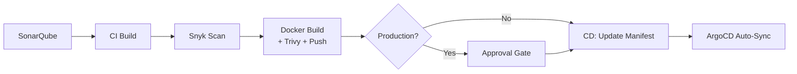

# CareNest — Reusable CI/CD Workflow Templates

Centralized, production-grade GitHub Actions workflow templates used by all CareNest microservice repositories.

---

## 📁 Workflow Inventory

| Template | Purpose | Fails On |
|---|---|---|
| `template-sonarqube.yml` | Static code analysis & quality gate | Quality gate failure |
| `template-ci.yml` | Install dependencies & build | Build errors |
| `template-build-snyk.yml` | Dependency vulnerability scan | HIGH/CRITICAL vulns |
| `template-docker.yml` | Docker build + Trivy scan + push | HIGH/CRITICAL image vulns |
| `template-approval-gate.yml` | Manual approval for production | Reviewer rejection |
| `template-cd.yml` | Update manifest repo (GitOps) | Git push failure |

---

## 🔄 Pipeline Flow

Every microservice follows this **strict sequential order**:



```
① SonarQube  →  ② CI Build  →  ③ Snyk  →  ④ Docker+Trivy+Push  →  ⑤ Approval  →  ⑥ CD
```

Each stage **blocks** the next — a failure at any point stops the pipeline.

---

## 📘 Workflow Details

### 1. `template-sonarqube.yml`

Runs SonarQube static analysis against the source code and enforces the quality gate.

**Inputs:**
| Input | Required | Default | Description |
|---|---|---|---|
| `project-key` | ✅ | — | SonarQube project key |
| `sources` | ❌ | `src` | Source directory to scan |
| `exclusions` | ❌ | `node_modules/**,...` | Glob patterns to exclude |

**Secrets:**
- `SONAR_HOST_URL` — SonarQube server URL
- `SONAR_TOKEN` — Authentication token

---

### 2. `template-ci.yml`

Installs Node.js dependencies and optionally runs the build step (for frontend).

**Inputs:**
| Input | Required | Default | Description |
|---|---|---|---|
| `node-version` | ❌ | `20` | Node.js version |
| `working-directory` | ❌ | `.` | Project root |
| `has-build-step` | ❌ | `false` | Set `true` for frontend |

---

### 3. `template-build-snyk.yml`

Scans npm dependencies for known vulnerabilities using Snyk CLI.

**Inputs:**
| Input | Required | Default | Description |
|---|---|---|---|
| `node-version` | ❌ | `20` | Node.js version |
| `severity-threshold` | ❌ | `high` | Minimum severity to fail |
| `monitor` | ❌ | `true` | Upload snapshot to Snyk dashboard |

**Secrets:**
- `SNYK_TOKEN` — Snyk API token

---

### 4. `template-docker.yml` ⚠️ Critical

Builds Docker image, scans with Trivy, and pushes **only if scan passes**.

**Image Tagging Strategy (3 tags always applied):**
```
<dockerhub_user>/carenest-auth-service:latest
<dockerhub_user>/carenest-auth-service:sha-abc1234
<dockerhub_user>/carenest-auth-service:v1.2.0    ← only if git tag exists
```

**Inputs:**
| Input | Required | Default | Description |
|---|---|---|---|
| `image-name` | ✅ | — | Image name (e.g., `carenest-auth-service`) |
| `dockerfile-path` | ❌ | `./Dockerfile` | Dockerfile location |
| `context` | ❌ | `.` | Build context |
| `trivy-severity` | ❌ | `HIGH,CRITICAL` | Severity levels to fail on |

**Outputs:**
| Output | Description |
|---|---|
| `image-tag` | The SHA-based tag that was pushed |
| `full-image` | Full image reference with SHA tag |

**Secrets:**
- `DOCKERHUB_USERNAME`
- `DOCKERHUB_TOKEN`

**Internal Steps:**
1. Generate tags (latest + SHA + semver if tagged)
2. Setup Docker Buildx
3. Login to DockerHub
4. Build image (load locally, no push)
5. **Trivy scan** — fail on HIGH/CRITICAL
6. Push all tags (only if Trivy passes)

---

### 5. `template-approval-gate.yml`

Uses GitHub Environment protection rules for manual approval.

**Setup Required:**
1. Go to repo **Settings → Environments**
2. Create environment named `production`
3. Enable **Required reviewers**
4. Add designated approvers

**Inputs:**
| Input | Required | Default | Description |
|---|---|---|---|
| `environment` | ❌ | `production` | GitHub environment name |

---

### 6. `template-cd.yml`

Clones the manifest repo, updates the service's image tag in `values.yaml`, commits and pushes. ArgoCD detects the change and auto-syncs.

**Inputs:**
| Input | Required | Default | Description |
|---|---|---|---|
| `service-name` | ✅ | — | Service key in values.yaml |
| `image-tag` | ✅ | — | New image tag to deploy |
| `manifest-repo` | ✅ | — | Manifest repo (org/repo) |
| `values-path` | ❌ | `helm/carenest/values.yaml` | Path to values file |
| `target-branch` | ❌ | `main` | Branch to update |

**Secrets:**
- `GH_PAT` — Personal access token with `repo` scope for the manifest repo

---

## 🔐 Required GitHub Secrets

Each microservice repository must configure these secrets:

| Secret | Description |
|---|---|
| `SONAR_HOST_URL` | SonarQube server URL (e.g., `http://sonar.example.com:9000`) |
| `SONAR_TOKEN` | SonarQube project token |
| `SNYK_TOKEN` | Snyk API token |
| `DOCKERHUB_USERNAME` | DockerHub username |
| `DOCKERHUB_TOKEN` | DockerHub access token |
| `GH_PAT` | GitHub PAT with write access to `carenest-manifest` repo |

---

## 🔗 How Microservices Call These Templates

Each microservice repo contains a single `.github/workflows/ci.yml` that chains the templates:

```yaml
name: CI/CD Pipeline
on:
  push:
    branches: [main]
    tags: ['v*']

jobs:
  sonarqube:
    uses: <org>/carenest-template/.github/workflows/template-sonarqube.yml@main
    # ...

  build:
    needs: [sonarqube]
    uses: <org>/carenest-template/.github/workflows/template-ci.yml@main
    # ...

  snyk:
    needs: [build]
    uses: <org>/carenest-template/.github/workflows/template-build-snyk.yml@main
    # ...

  docker:
    needs: [snyk]
    uses: <org>/carenest-template/.github/workflows/template-docker.yml@main
    # ...

  approval:
    needs: [docker]
    uses: <org>/carenest-template/.github/workflows/template-approval-gate.yml@main
    # ...

  deploy:
    needs: [approval]
    uses: <org>/carenest-template/.github/workflows/template-cd.yml@main
    # ...
```

---

## 📌 Notes

- All templates use `on: workflow_call` — they cannot be triggered directly
- Template updates in `main` branch immediately affect all consuming repos
- Pin to a specific SHA or tag (e.g., `@v1.0.0`) for stability in production
